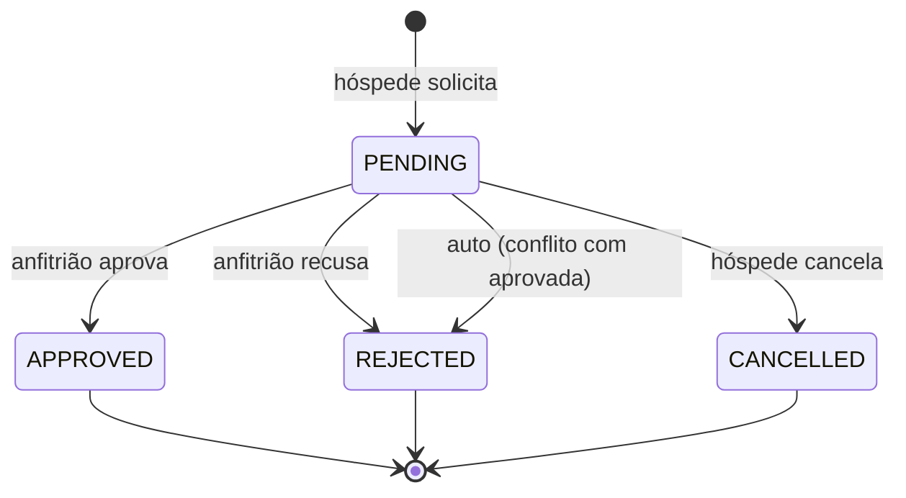

# Modelo de Dados — MVP Aluguel de Imóveis

## Diagrama ER

```mermaid
erDiagram
    USER ||--o{ PROPERTY : "possui (host)"
    USER ||--o{ BOOKING : "solicita (guest)"
    USER ||--o{ REVIEW : "escreve"
    USER ||--o{ FAVORITE : "salva"
    PROPERTY ||--o{ PHOTO : "tem"
    PROPERTY }o--o{ AMENITY : "oferece"
    PROPERTY ||--o{ BOOKING : "recebe"
    PROPERTY ||--o{ FAVORITE : "é favoritado por"
    BOOKING |o--o| REVIEW : "gera"

    USER {
        int id PK
        string name
        string email UK
        string password "hash"
        string role "guest|host"
    }
    PROPERTY {
        int id PK
        int host_id FK
        string title
        text description
        string address
        string city
        string state
        decimal latitude
        decimal longitude
        decimal price_per_night
        int max_guests
        bool is_active
        datetime created_at
    }
    PHOTO {
        int id PK
        int property_id FK
        string url
        string caption
        int order
    }
    AMENITY {
        int id PK
        string name UK
        string icon
    }
    BOOKING {
        int id PK
        int property_id FK
        int guest_id FK
        date check_in
        date check_out
        int guests
        decimal total_price
        string status "PENDING|APPROVED|REJECTED|CANCELLED"
        string card_holder
        string card_last4
        string card_brand
        datetime created_at
    }
    REVIEW {
        int id PK
        int booking_id FK UK
        int property_id FK
        int author_id FK
        int rating "1..5"
        text comment
        datetime created_at
    }
    FAVORITE {
        int id PK
        int user_id FK
        int property_id FK
        datetime created_at
        "unique(user, property)"
    }
```

## Entidades

### User (`accounts.User`)
`AbstractUser` customizado; login por **e-mail**.

| Campo | Tipo | Regras |
|-------|------|--------|
| name | CharField(150) | obrigatório |
| email | EmailField | único; usado como `USERNAME_FIELD` |
| role | CharField | `guest` ou `host` |

### Property (`properties.Property`)
| Campo | Tipo | Regras |
|-------|------|--------|
| host | FK User | `role=host`; dono do recurso |
| title / description | Char(200) / Text | obrigatórios |
| address, city, state | Char | cidade indexada p/ busca |
| latitude, longitude | Decimal(9,6) | p/ mapa |
| price_per_night | Decimal(10,2) | > 0 |
| max_guests | PositiveInt | ≥ 1 |
| is_active | Bool | soft delete |

Propriedades derivadas: `avg_rating`, `review_count` (annotate).

### Photo / Amenity
- `Photo`: `url` (URLField), `caption`, `order` — ordenada por `order`.
- `Amenity`: catálogo fixo (seed) — `name` único + `icon` (emoji).

### Booking (`bookings.Booking`)
| Campo | Tipo | Regras |
|-------|------|--------|
| property / guest | FKs | guest ≠ property.host |
| check_in / check_out | Date | RN01/RN02 |
| guests | PositiveInt | ≤ property.max_guests |
| total_price | Decimal | calculado (RN06) |
| status | choices | `PENDING` → `APPROVED`/`REJECTED`; `PENDING` → `CANCELLED` (pelo hóspede) |
| card_holder / card_last4 / card_brand | Char | nunca armazenar número completo/CVV |

### Review (`properties.Review`)
Uma por reserva (`OneToOne booking`); só após check-out de reserva aprovada; `rating` 1–5.

### Favorite (`properties.Favorite`)
Imóvel salvo por um hóspede (lista de desejos).

| Campo | Tipo | Regras |
|-------|------|--------|
| user | FK User | hóspede (`role=guest`) |
| property | FK Property | deve estar ativo (`is_active=True`) |
| created_at | DateTime | auto |

Restrição: par **único** (`unique_together = [("user", "property")]`) — não
dá para favoritar o mesmo imóvel duas vezes. O endpoint `toggle` alterna
(salvar/remove) em uma única chamada.

## Máquina de estados da reserva


