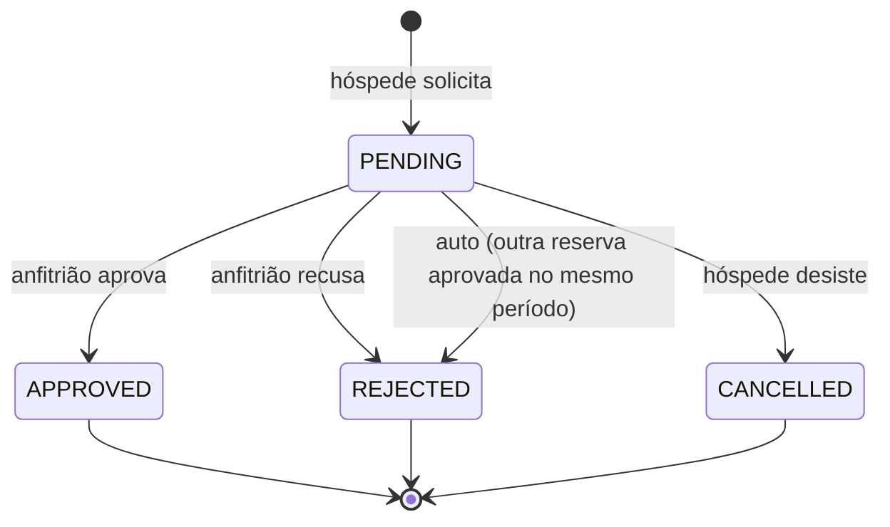

# Regras de Negócio — Guia para Apresentação

> 📌 **Para quê serve este documento?**
> Explica, em linguagem simples, **o que o sistema faz e por quê**.
> É a parte "de negócio" da apresentação: o que um produto estilo Airbnb
> precisa resolver, e como o CommitStay resolve cada situação.
>
> Leitura recomendada antes de apresentar para pessoas não-técnicas
> (clientes, gestores, turma) ou para responder perguntas do tipo
> *"e se dois hóspedes pedirem o mesmo imóvel no mesmo dia?"*.

---

## 1. O problema que o produto resolve

Pense em uma plataforma de aluguel por temporada (estilo Airbnb).
Tem dois "lados" que precisam conversar sem nunca se falar diretamente:

- **Anfitriões** → pessoas que têm um imóvel e querem alugar.
- **Hóspedes** → pessoas que querem encontrar um lugar para ficar.

O sistema é o ** intermediário confiável** entre os dois. Ele precisa:

1. Mostrar imóveis de forma que o hóspede **encontre o que quer**.
2. Garantir que **duas pessoas não reservem o mesmo imóvel no mesmo dia**.
3. Deixar o anfitrião no **controle** de quem fica no imóvel dele.
4. **Proteger dados sensíveis** (cartão de crédito, principalmente).
5. Ser **justo**: o hóspede só paga o preço certo, o anfitrião só vê os
   próprios imóveis, ninguém mexe no que não é seu.

Cada regra abaixo existe para resolver um desses pontos.

---

## 2. Os três tipos de usuário (Atores)

| Quem | O que pode | O que **não** pode |
|------|------------|-------------------|
| **Visitante** (sem login) | Pesquisar, filtrar, ver no mapa, abrir detalhes, ver avaliações | Reservar, favoritar, gerenciar imóveis |
| **Hóspede** | Tudo que o visitante faz + reservar, favoritar, cancelar reserva pendente, avaliar após a estadia | Criar/editar imóveis, aprovar reservas |
| **Anfitrião** | Tudo que o visitante faz + cadastrar/editar/desativar os próprios imóveis + aprovar/recusar pedidos | Reservar imóveis (nem os próprios) |

> 💡 **Decisão de produto:** cada conta tem **um único papel**, escolhido no
> cadastro. Isso deixa os painéis e as permissões simples. Uma conta não é
> "híbrida". (Decisão documentada em `02-plan.md`, ADR #1.)

---

## 3. A jornada do hóspede (passo a passo)

```
[Pesquisa] → [Abre o imóvel] → [Escolhe datas no calendário] → [Preenche cartão]
     → [Envia o pedido (Pendente)] → [Anfitrião aprova] → [Estadia] → [Avalia]
```

1. **Pesquisa** com filtros: cidade, datas, nº de hóspedes, faixa de preço.
   O mapa mostra marcadores com o preço de cada imóvel.
2. **Abre o detalhe**: fotos, comodidades, descrição, avaliações, localização.
3. **Calendário** mostra os dias **já reservados** como bloqueados.
4. **Seleciona um intervalo** livre e informa quantas pessoas vão.
5. **Pagamento (simulado)**: nome no cartão, número, validade, CVV.
6. Envia → a reserva nasce com status **Pendente**.
7. O **anfitrião aprova ou recusa**.
8. Depois do check-out, o hóspede pode **avaliar** (nota 1–5 + comentário).

---

## 4. A jornada do anfitrião

```
[Cadastra imóvel] → [Recebe pedidos] → [Aprova / Recusa] → [Vê avaliações chegarem]
```

1. **Cadastra o imóvel**: título, descrição, endereço, latitude/longitude,
   preço por diária, capacidade máxima, comodidades e **fotos por URL**.
2. Vê os **pedidos recebidos** no painel, podendo filtrar por status.
3. **Aprova** ou **recusa** cada pedido.
4. Ao aprovar, o sistema automaticamente **recusa os outros pedidos
   conflitantes** no mesmo período (evita overbooking).

---

## 5. O ciclo de vida de uma reserva (Máquina de Estados)

Toda reserva começa **Pendente** e nunca volta atrás. Isso é importante
para apresentar: o status **só avança**.



| Status | Significado | Quem mexe |
|--------|-------------|-----------|
| **PENDING** (Pendente) | Pedido feito, aguardando o anfitrião | Criado pelo hóspede |
| **APPROVED** (Aprovada) | Anfitrião aceitou — o imóvel está garantido | Anfitrião |
| **REJECTED** (Recusada) | Anfitrião não aceitou **ou** foi automaticamente recusada por conflito | Anfitrião / sistema |
| **CANCELLED** (Cancelada) | O hóspede desistiu antes da aprovação | Hóspede |

> 🔑 **Por que não dá pra "desistir" de uma reserva já aprovada?**
> No MVP, o cancelamento só existe para pedidos **Pendente**. Depois de
> aprovado, considera-se um acordo fechado. Isso simplifica o MVP e evita
> reembolsos (que exigiriam um gateway de pagamento real — fora de escopo).

---

## 6. As regras de negócio, uma a uma (com o "por quê")

### RN01 — A saída tem que ser depois da entrada; nada no passado
- **A regra:** `check_out` deve ser **depois** de `check_in`, e `check_in`
  não pode ser uma data que já passou.
- **Por quê:** uma reserva de "hoje até ontem" não faz sentido; e reservar
  datas passadas seria só um bug/abuso.

### RN02 — Conflito de datas (o coração do sistema)
- **A regra:** dois intervalos **conflitam** quando se sobrepõem, **mas o
  check-out libera o dia**. Ou seja, alguém pode entrar no mesmo dia em que
  o outro saiu.
- **Como o código verifica:** `check_in < outra.check_out` **e**
  `check_out > outra.check_in`.
- **Por quê:** imagine que o hóspede A sai dia 10 e o hóspede B quer entrar
  dia 10. Isso é permitido (o dia 10 "pertence" ao B a partir do check-in).
  Já entrar dia 9 enquanto A sai dia 10 → conflito, proibido.

### RN03 — Só reservas **aprovadas** bloqueiam o calendário
- **A regra:** pedidos **Pendentes** **não** bloqueiam datas. Só
  **Aprovadas**.
- **Por quê:** enquanto o anfitrião não aprovou, nada é garantido. Dois
  hóspedes podem pedir o mesmo período; o anfitrião escolhe um. Se pedidos
  pendentes já bloqueassem o calendário, ninguém conseguiria reservar um
  imóvel popular enquanto o anfitrião demorasse a responder.

### RN04 — Cada um só mexe no que é seu
- **A regra:** o anfitrião só vê/edita **os próprios imóveis** e só responde
  reservas dos **próprios imóveis**. O hóspede só vê **as próprias
  reservas**.
- **Por quê:** privacidade e segurança. Sem isso, qualquer anfitrião
  conseguiria editar o imóvel do concorrente ou ver reservas alheias.

### RN05 — Ninguém reserva o próprio imóvel
- **A regra:** o hóspede não pode reservar um imóvel do qual ele é
  anfitrião.
- **Por quê:** evita auto-reserva (usada para inflar avaliações ou testar o
  fluxo de pagamento de forma indevida).

### RN06 — O preço é calculado pelo backend, nunca confiado ao frontend
- **A regra:** `total = nº de diárias × preço por diária`. O cálculo é
  feito **no servidor** no momento de criar a reserva.
- **Por quê:** o frontend é "controlável" pelo usuário. Se o preço viesse
  pronto do navegador, alguém poderia manipular e reservar pagando R$ 1.
  O backend pega o preço **do banco** e calcula sozinho — confiável.

### RN07 — Avaliação só depois da estadia, e uma por reserva
- **A regra:** só pode avaliar quem teve reserva **Aprovada** **e** o
  check-out já passou. E cada reserva gera **no máximo uma** avaliação.
- **Por quê:** evita avaliações falsas (de quem nem foi) e evita que alguém
  bombardeie um imóvel com várias notas.

---

## 7. A regra "secreta" que evita overbooking (RF05.3)

> Esta é a regra que mais chama atenção em apresentação. Vale destacar.

**Cenário:**
- Imóvel X, datas 10→15.
- Hóspede A pede (Pendente).
- Hóspede B também pede as mesmas datas (Pendente). → **permitido** (RN03:
  pendente não bloqueia).
- Anfitrião **aprova** o pedido do A.

**O que acontece automaticamente:**
O pedido do B (e qualquer outro pendente conflitante) é **recusado
sozinho**, sem o anfitrião precisar fazer nada.

**Por quê isso importa:**
- Evita **overbooking** (dois hóspedes achando que vão ficar no mesmo lugar).
- Mantém o painel do anfitrião **limpo**: ele não precisa lembrar de
  recusar manualmente cada pedido perdedor.
- Garante um estado **consistente**: nunca duas reservas aprovadas no mesmo
  período.

---

## 8. Segurança de dados de pagamento (RNF04)

O MVP **não cobra de verdade**. Mas, mesmo assim, trata o cartão com
cuidado real:

| Dado | O que o sistema faz |
|------|---------------------|
| Número do cartão | Valida o **formato** (algoritmo de Luhn + tamanho) e a **bandeira**, mas **descarta** o número depois de guardar só os **4 últimos dígitos** |
| CVV | Validado em formato e **nunca salvo** |
| Validade | Validada (MM/AA, não pode estar expirada) e **não salva** |
| Titular | Salvo (é só o nome impresso) |

> 🔐 **Mensagem para a apresentação:** "Mesmo num MVP sem cobrança real,
> o sistema já aplica a regra de ouro de pagamentos: **nunca persistir o
> número completo nem o CVV**. Isso é o que um sistema de produção faria."

---

## 9. Como a busca "destaca" os melhores imóveis (RF01.1)

A página inicial não mostra os imóveis em ordem aleatória. Ela ordena por
**destaque**:

1. **Nota média** de avaliações (maior primeiro).
2. Em caso de empate na nota, **quem tem mais avaliações** aparece antes
   (um 5,0 com 50 avaliações é mais confiável que um 5,0 com 1).
3. Em empate total, os **mais recentes**.

Além disso, a home agrupa imóveis **por cidade** em carrosséis e mostra um
carrossel especial "Preferidos dos hóspedes" (nota ≥ 4,5).

---

## 10. Os filtros de busca (RF01.2) — o que cada um faz

| Filtro | O que faz no banco |
|--------|--------------------|
| **Cidade** | Busca parcial (`icontains`) — "São" acha "São Paulo" e "São José" |
| **Datas** (check-in/check-out) | **Exclui** imóveis que têm reserva **Aprovada** conflitante naquele período |
| **Hóspedes** | Mostra só imóveis cuja capacidade máxima seja ≥ o informado |
| **Preço mín./máx.** | Faixa da diária |

> 💡 Repare: o filtro de datas **não** busca imóveis por disponibilidade
> "marcando" os dias; ele **elimina** os que teriam conflito. É a forma
> simples e correta de "mostrar só o que dá pra reservar".

---

## 11. Favoritos (regra de produto)

- Só **hóspedes** podem favoritar (anfitrião não precisa disso no MVP).
- Não dá pra favoritar o mesmo imóvel duas vezes (é um par único
  usuário + imóvel).
- O botão de coração **alterna** (toggle): clicar de novo **remove**.
- Só é possível favoritar imóveis **ativos**.

---

## 12. O que está **fora** do MVP (e por quê)

Deixar claro o que **não** faz parte ajuda a apresentação: mostra maturidade
e foco.

| Item | Por quê ficou de fora |
|------|-----------------------|
| Gateway de pagamento real | Exige integração, chaves e compliance (PCI) — escopo de outro projeto |
| Chat entre hóspede e anfitrião | Adiciona complexidade de tempo real e moderação |
| Notificações por e-mail | Exige provedor de e-mail (ex.: Resend/SES) |
| Upload de foto (binário) | Exige storage — usamos URLs (Unsplash) no MVP |
| Múltiplas moedas / i18n | Foco no público brasileiro no MVP |
| Cancelamento de reserva já aprovada + reembolso | Depende de pagamento real |

> 🎯 **Roteiro de apresentação sugerido:** comece pela **jornada do
> hóspede** (Seção 3), depois mostre a **jornada do anfitrião** (Seção 4),
> então destaque a **regra anti-overbooking** (Seção 7) e a **segurança do
> cartão** (Seção 8). São os momentos "uau" do produto.
